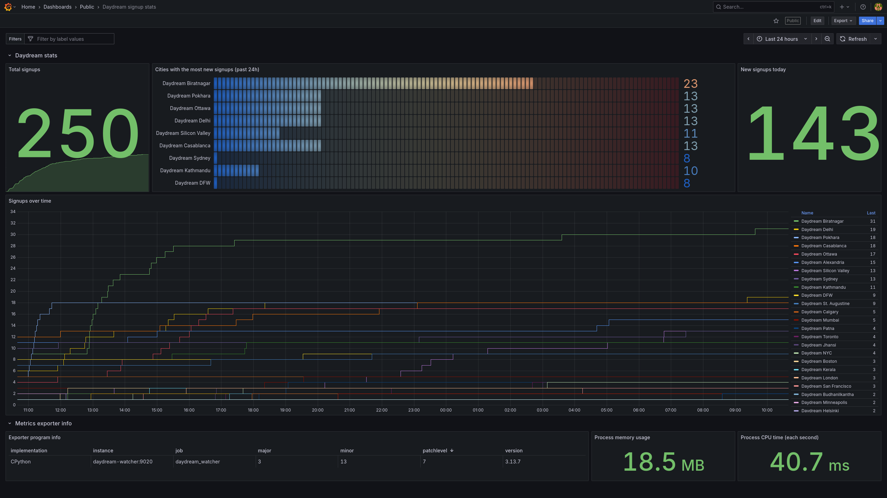

# Daydream Watcher

Tracks signups to Hack Club's global [Daydream](https://daydream.hackclub.com/) hackathon across 140+ cities, providing Prometheus metrics that can be used to make dashboards like the demo below.

## Online demo

[](https://grafana.slevel.xyz/d/7cf71d22-8490-40f7-b280-f677005d2fda/daydream-signup-stats)

**[🌍 Daydream signup stats - Dashboard on grafana.slevel.xyz](https://grafana.slevel.xyz/d/7cf71d22-8490-40f7-b280-f677005d2fda/daydream-signup-stats)**

## Local development

This project uses Python (3.9+) and [uv](https://docs.astral.sh/uv/) for development.

1. Clone the repo
2. `uv run main.py`
3. Head to <http://localhost:9020/metrics> to see the metrics

## Production deployment with Docker Compose

1. Download the example Compose file from [deployment/docker-compose.yml](deployment/docker-compose.yml). Feel free to adjust it to your needs.
2. Start it with `docker-compose up -d`
3. Metrics should now be available at <http://localhost:9090/metrics>

### Example `prometheus.yml` config

Start tracking the metrics by adding Daydream Watcher as a scrape config to a Prometheus-compatible database (e.g. Prometheus, VictoriaMetrics).

```yaml
scrape_configs:
  - job_name: daydream_watcher
    scrape_interval: "10s"
    static_configs:
      - targets: ["daydream-watcher:9020"]
```

### Example Grafana dashboard

Start visualising the metrics by importing the example Grafana dashboard at [deployment/grafana-dashboard.json](deployment/grafana-dashboard.json) into your Grafana instance.

The example dashboard matches the code used by the public demo as of 22 August 2025.

## Maintainers: Releasing a new version

Use the `release-new-version.sh` shell script, e.g.

```bash
./release-new-version.sh 0.2.1
```

It will

1. Bump the version in `pyproject.toml`
2. Create and push a Git tag for the new version
3. Build and publish the Docker image to Docker Hub

Then, manually check that the version bump commit is as expected, and `git push` it.
